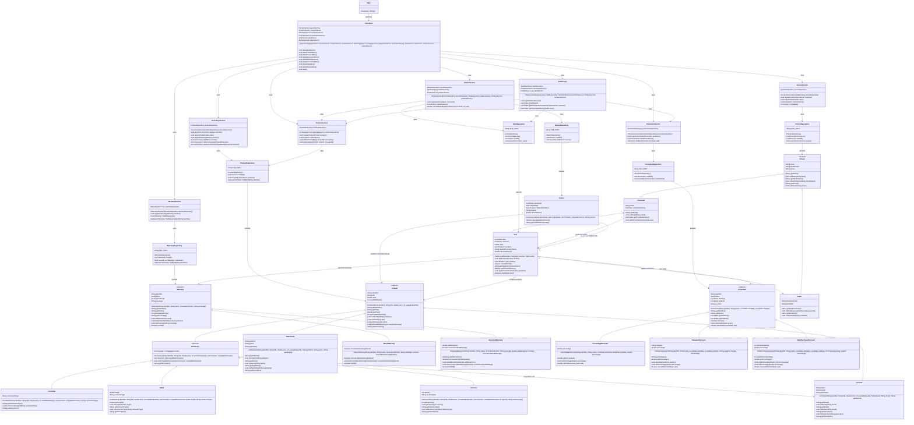

```mermaid
classDiagram
direction TB
%% =========================
%% PRODUCT HIERARCHY
%% =========================
class Product {
<<abstract>>
-String identifier
-String title
-double price
-int availableQuantity
+Product(String identifier, String title, double price, int availableQuantity)
+String getIdentifier()
+String getTitle()
+double getPrice()
+int getAvailableQuantity()
+void setIdentifier(String identifier)
+void setTitle(String title)
+void setPrice(double price)
+void setAvailableQuantity(int availableQuantity)
+String getDescription()*
}
class Accessory {
<<abstract>>
-List~Console~ compatibleConsoles
+Accessory(String identifier, String title, double price, int availableQuantity, List~Console~ compatibleConsoles)
+List~Console~ getCompatibleConsoles()
+void setCompatibleConsoles(List~Console~ compatibleConsoles)
+String getDescription()
}
class Controller {
-String connectionType
+Controller(String identifier, String title, double price, int availableQuantity, List~Console~ compatibleConsoles, String connectionType)
+String getConnectionType()
+void setConnectionType(String connectionType)
+String getDescription()
}
class Cable {
-double length
-String connectorType
+Cable(String identifier, String title, double price, int availableQuantity, List~Console~ compatibleConsoles, double length, String connectorType)
+double getLength()
+void setLength(double length)
+String getConnectorType()
+void setConnectorType(String connectorType)
+String getDescription()
}
class Memory {
-int capacity
-String memoryType
+Memory(String identifier, String title, double price, int availableQuantity, List~Console~ compatibleConsoles, int capacity, String memoryType)
+int getCapacity()
+void setCapacity(int capacity)
+String getMemoryType()
+void setMemoryType(String memoryType)
+String getDescription()
}
class VideoGame {
-String platform
-String genre
-String ageRating
+VideoGame(String identifier, String title, double price, int availableQuantity, String platform, String genre, String ageRating)
+String getPlatform()
+void setPlatform(String platform)
+String getGenre()
+void setGenre(String genre)
+String getAgeRating()
+void setAgeRating(String ageRating)
+String getDescription()
}
class Console {
-String brand
-String model
-String generation
+Console(String identifier, String title, double price, int availableQuantity, String brand, String model, String generation)
+String getBrand()
+void setBrand(String brand)
+String getModel()
+void setModel(String model)
+String getGeneration()
+void setGeneration(String generation)
+String getDescription()
}
%% =========================
%% WARRANTY HIERARCHY
%% =========================
class Warranty {
<<abstract>>
-String identifier
-String name
-int durationMonths
-String coverage
+Warranty(String identifier, String name, int durationMonths, String coverage)
+String getIdentifier()
+String getName()
+int getDurationMonths()
+String getCoverage()
+void setName(String name)
+void setDurationMonths(int durationMonths)
+void setCoverage(String coverage)
+boolean isValid()*
}
class BasicWarranty {
-boolean coversManufacturingDefects
+BasicWarranty(String identifier, String name, int durationMonths, String coverage, boolean coversManufacturingDefects)
+boolean isCoversManufacturingDefects()
+void setCoversManufacturingDefects(boolean coversManufacturingDefects)
+boolean isValid()
}
class ExtendedWarranty {
-double additionalCost
-boolean coversAccidentalDamage
+ExtendedWarranty(String identifier, String name, int durationMonths, String coverage, double additionalCost, boolean coversAccidentalDamage)
+double getAdditionalCost()
+boolean isCoversAccidentalDamage()
+void setAdditionalCost(double additionalCost)
+void setCoversAccidentalDamage(boolean coversAccidentalDamage)
+boolean isValid()
}
%% =========================
%% PROMOTION HIERARCHY
%% =========================
class Promotion {
<<abstract>>
-String identifier
-String name
-LocalDate startDate
-LocalDate endDate
-boolean active
+Promotion(String identifier, String name, LocalDate startDate, LocalDate endDate)
+String getIdentifier()
+String getName()
+LocalDate getStartDate()
+LocalDate getEndDate()
+boolean isActive()
+void setActive(boolean active)
+double calculateDiscount(Sale sale)*
}
class PercentageDiscount {
-double percentage
+PercentageDiscount(String identifier, String name, LocalDate startDate, LocalDate endDate, double percentage)
+double getPercentage()
+void setPercentage(double percentage)
+double calculateDiscount(Sale sale)
}
class CategoryDiscount {
-String category
-double percentage
+CategoryDiscount(String identifier, String name, LocalDate startDate, LocalDate endDate, String category, double percentage)
+String getCategory()
+double getPercentage()
+void setCategory(String category)
+void setPercentage(double percentage)
+double calculateDiscount(Sale sale)
}
class BulkPurchaseDiscount {
-int minimumQuantity
-double percentage
+BulkPurchaseDiscount(String identifier, String name, LocalDate startDate, LocalDate endDate, int minimumQuantity, double percentage)
+int getMinimumQuantity()
+double getPercentage()
+void setMinimumQuantity(int minimumQuantity)
+void setPercentage(double percentage)
+double calculateDiscount(Sale sale)
}
%% =========================
%% PERSON HIERARCHY
%% =========================
class Person {
<<abstract>>
-String name
-String identification
-String phone
+String getName()
+void setName(String name)
+String getIdentification()
+void setIdentification(String identification)
+String getPhone()
+void setPhone(String phone)
}
class Customer {
-String email
-List~Sale~ purchaseHistory
+String getEmail()
+void setEmail(String email)
+List~Sale~ getPurchaseHistory()
+void addToPurchaseHistory(Sale sale)
}
class Seller {
-String employeeCode
-String workShift
+String getEmployeeCode()
+void setEmployeeCode(String employeeCode)
+String getWorkShift()
+void setWorkShift(String workShift)
}
%% =========================
%% SALE
%% =========================
class Sale {
-LocalDate date
-Customer customer
-Seller seller
-List~Product~ products
-String appliedPromotionName
-double discountAmount
+Sale(LocalDate date, Customer customer, Seller seller)
+void addProduct(Product product)
+List~Product~ getProducts()
+double calculateTotal()
+String getAppliedPromotionName()
+double getDiscountAmount()
+void applyPromotion(Promotion promotion)
+boolean canBeReturned()
}
%% =========================
%% RETURN
%% =========================
class Return {
-LocalDate returnDate
-Sale originalSale
-List~Product~ returnedProducts
-String reason
-double refundAmount
+Return(LocalDate returnDate, Sale originalSale, List~Product~ returnedProducts, String reason)
+double calculateRefundAmount()
+String generateReturnReceipt()
}
%% =========================
%% PERSISTENCE LAYER
%% =========================
class PersonRepository {
-String FILE_PATH
+PersonRepository()
+void save(Person person)
+List~Person~ loadAll()
+void saveAll(List~Person~ people)
}
class ProductRepository {
-String FILE_PATH
+ProductRepository()
+List~Product~ loadAll()
+void saveAll(List~Product~ products)
+Optional~Product~ findById(String identifier)
}
class WarrantyRepository {
-String FILE_PATH
+WarrantyRepository()
+List~Warranty~ loadAll()
+void saveAll(List~Warranty~ warranties)
+Optional~Warranty~ findById(String identifier)
}
class PromotionRepository {
-String FILE_PATH
+PromotionRepository()
+List~Promotion~ loadAll()
+void saveAll(List~Promotion~ promotions)
}
class SaleRepository {
-String FILE_PATH
+SaleRepository()
+void save(Sale sale)
+List~Sale~ loadAll()
+void saveAll(List~Sale~ sales)
}
class ReturnRepository {
-String FILE_PATH
+ReturnRepository()
+List~Return~ loadAll()
+void saveAll(List~Return~ returns)
}
%% =========================
%% SERVICE LAYER
%% =========================
class PersonService {
-PersonRepository personRepository
+PersonService(PersonRepository personRepository)
+void registerCustomer(Customer customer)
+void registerSeller(Seller seller)
+List~Customer~ listCustomers()
+List~Seller~ listSellers()
}
class ProductService {
-ProductRepository productRepository
+ProductService(ProductRepository productRepository)
+void registerProduct(Product product)
+List~Product~ listProducts()
+void updateStock(String productId, int quantity)
+void restoreStock(Product product, int quantity)
}
class AccessoryService {
-ProductRepository productRepository
+AccessoryService(ProductRepository productRepository)
+void registerController(Controller controller)
+void registerCable(Cable cable)
+void registerMemory(Memory memory)
+List~Accessory~ listAllAccessories()
+List~Accessory~ listAccessoriesByType(String type)
+List~Accessory~ findAccessoriesCompatibleWith(Console console)
}
class WarrantyService {
-WarrantyRepository warrantyRepository
+WarrantyService(WarrantyRepository warrantyRepository)
+void registerWarranty(Warranty warranty)
+List~Warranty~ listAllWarranties()
+Optional~Warranty~ findWarrantyById(String identifier)
}
class PromotionService {
-PromotionRepository promotionRepository
+PromotionService(PromotionRepository promotionRepository)
+void registerPromotion(Promotion promotion)
+List~Promotion~ listAllPromotions()
+Promotion findBestPromotionFor(Sale sale)
}
class SaleService {
-SaleRepository saleRepository
-PromotionService promotionService
-ProductService productService
+SaleService(SaleRepository saleRepository, PromotionService promotionService, ProductService productService)
+void registerSale(Sale sale)
+List~Sale~ listAllSales()
+List~Sale~ getCustomerPurchaseHistory(Customer customer)
+List~Sale~ getSellerSalesHistory(Seller seller)
}
class ReturnService {
-ReturnRepository returnRepository
-SaleRepository saleRepository
-ProductService productService
+ReturnService(ReturnRepository returnRepository, SaleRepository saleRepository, ProductService productService)
+void registerReturn(Return returnItem)
+List~Return~ listAllReturns()
+double calculateMonthlyReturnBalance(int month, int year)
}
%% =========================
%% USER INTERFACE
%% =========================
class ConsoleUI {
-PersonService personService
-ProductService productService
-WarrantyService warrantyService
-PromotionService promotionService
-SaleService saleService
-ReturnService returnService
+ConsoleUI(PersonService personService, ProductService productService, WarrantyService warrantyService, PromotionService promotionService, SaleService saleService, ReturnService returnService)
+void showMainMenu()
+void showPersonMenu()
+void showProductMenu()
+void showAccessoryMenu()
+void showWarrantyMenu()
+void showPromotionMenu()
+void showSaleMenu()
+void showReturnMenu()
+void start()
}
class Main {
+main(args: String[])
}
%% =========================
%% INHERITANCE RELATIONSHIPS
%% =========================
Product <|-- Accessory
Product <|-- VideoGame
Product <|-- Console
Accessory <|-- Controller
Accessory <|-- Cable
Accessory <|-- Memory
Warranty <|-- BasicWarranty
Warranty <|-- ExtendedWarranty
Promotion <|-- PercentageDiscount
Promotion <|-- CategoryDiscount
Promotion <|-- BulkPurchaseDiscount
Person <|-- Customer
Person <|-- Seller
%% =========================
%% COMPOSITION & ASSOCIATION
%% =========================
Sale "1" --> "1" Customer : has customer
Sale "1" --> "1" Seller : has seller
Sale "1" --> "1..*" Product : contains products
Sale "0..1" --> "0..1" Warranty : may have warranty
Sale "0..1" --> "0..1" Promotion : applies promotion
Return "1" --> "1" Sale : references original sale
Return "1" --> "1..*" Product : contains returned products
Accessory "0..*" --> "0..*" Console : compatible with
Customer "1" --> "0..*" Sale : purchase history
%% =========================
%% PERSISTENCE ASSOCIATIONS
%% =========================
PersonRepository --> Person : persists
ProductRepository --> Product : persists
WarrantyRepository --> Warranty : persists
PromotionRepository --> Promotion : persists
SaleRepository --> Sale : persists
ReturnRepository --> Return : persists
%% =========================
%% SERVICE DEPENDENCIES
%% =========================
PersonService --> PersonRepository : uses
ProductService --> ProductRepository : uses
AccessoryService --> ProductRepository : uses
WarrantyService --> WarrantyRepository : uses
PromotionService --> PromotionRepository : uses
SaleService --> SaleRepository : uses
SaleService --> PromotionService : uses
SaleService --> ProductService : uses
ReturnService --> ReturnRepository : uses
ReturnService --> SaleRepository : uses
ReturnService --> ProductService : uses
%% =========================
%% UI DEPENDENCIES
%% =========================
ConsoleUI --> PersonService : uses
ConsoleUI --> ProductService : uses
ConsoleUI --> AccessoryService : uses
ConsoleUI --> WarrantyService : uses
ConsoleUI --> PromotionService : uses
ConsoleUI --> SaleService : uses
ConsoleUI --> ReturnService : uses
Main --> ConsoleUI : launches
```