# Integrated Class Diagram — GameZone Unicesar (all modules)

```mermaid
---
config:
  layout: dagre
---
classDiagram
    direction TB

    namespace Domain {

        class Person {
            <<abstract>>
            -name: String
            -identification: String
            -phone: String
        }

        class Customer {
            -email: String
            -purchaseHistory: List~Sale~
        }

        class Seller {
            -employeeCode: String
            -workShift: String
        }

        class Product {
            <<abstract>>
            -identifier: String
            -title: String
            -price: double
            -availableQuantity: int
        }

        class VideoGame {
            -platform: String
            -genre: String
            -ageRating: String
        }

        class Console {
            -brand: String
            -model: String
            -generation: String
        }

        class Accessory {
            <<abstract>>
            -compatibleConsoleIds: List~String~
        }

        class Controller {
            -connectionType: String
        }

        class Cable {
            -lengthInMeters: double
            -connectorType: String
        }

        class Memory {
            -capacityInGigabytes: int
            -memoryType: String
        }

        class Sale {
            -identifier: String
            -date: LocalDate
            -customer: Customer
            -seller: Seller
            -products: List~Product~
            -appliedPromotionName: String
            -discountAmount: double
            -extendedWarrantyCost: double
            +getFinalTotal(): double
            +generateReceipt(): String
        }

        class Promotion {
            <<abstract>>
            -identifier: String
            -name: String
            -startDate: LocalDate
            -endDate: LocalDate
            +calculateDiscount(sale: Sale): double
        }

        class PercentageDiscount {
            -percentage: double
        }

        class CategoryDiscount {
            -percentage: double
            -targetCategory: String
        }

        class BulkPurchaseDiscount {
            -minimumQuantity: int
            -percentage: double
        }

        class Warranty {
            <<abstract>>
            -id: String
            -product: Product
            -sale: Sale
            -startDate: LocalDate
            -endDate: LocalDate
            +getAdditionalCost(): double
        }

        class BasicWarranty
        class ExtendedWarranty

        class Return {
            -identifier: String
            -date: LocalDate
            -sale: Sale
            -returnedProducts: List~Product~
            -reason: String
            -refundAmount: double
        }
    }

    namespace Persistence {

        class PersonRepository {
            +addPerson(person: Person): void
            +getPeople(): List~Person~
        }

        class ProductRepository {
            +saveAll(products: List~Product~): void
            +loadAll(): List~Product~
        }

        class AccessoryRepository {
            +saveAll(accessories: List~Accessory~): void
            +loadAll(): List~Accessory~
        }

        class SaleRepository {
            +save(sale: Sale): void
            +findByIdentifier(id: String): Sale
        }

        class PromotionRepository {
            +saveAll(promotions: List~Promotion~): void
            +loadAll(): List~Promotion~
        }

        class WarrantyRecord {
            -id: String
            -type: String
            -productId: String
            -saleId: String
            -startDate: LocalDate
        }

        class WarrantyRepository {
            +saveAll(warranties: List~Warranty~): void
            +loadAll(): List~WarrantyRecord~
        }

        class ReturnRepository {
            +saveAll(returns: List~Return~): void
            +loadAll(): List~Return~
        }
    }

    namespace Services {

        class PersonService {
            -personRepository: PersonRepository
        }

        class ProductService {
            -productRepository: ProductRepository
        }

        class AccessoryService {
            -accessoryRepository: AccessoryRepository
        }

        class PromotionService {
            -promotionRepository: PromotionRepository
            +findBestPromotionFor(sale: Sale): Promotion
        }

        class WarrantyService {
            -warrantyRepository: WarrantyRepository
            -saleRepository: SaleRepository
            -productService: ProductService
            +cancelWarranties(productId: String, saleId: String): double
        }

        class SaleService {
            -saleRepository: SaleRepository
            -productService: ProductService
            -accessoryService: AccessoryService
            -warrantyService: WarrantyService
            -promotionService: PromotionService
            +registerSale(sale: Sale, productIdsWithExtendedWarranty: List~String~): void
        }

        class ReturnService {
            -returnRepository: ReturnRepository
            -saleService: SaleService
            -productService: ProductService
            +registerReturn(saleId: String, productIds: List~String~, reason: String): Return
            +generateMonthlyBalance(month: int, year: int): double
        }
    }

    namespace UserInterface {

        class ConsoleMenu {
            +showProductMenu(): void
            +showPersonMenu(): void
            +showSaleMenu(): void
            +showWarrantyMenu(): void
            +showReturnMenu(): void
            +showPromotionMenu(): void
        }
    }

    Person <|-- Customer
    Person <|-- Seller
    Product <|-- VideoGame
    Product <|-- Console
    Product <|-- Accessory
    Accessory <|-- Controller
    Accessory <|-- Cable
    Accessory <|-- Memory
    Promotion <|-- PercentageDiscount
    Promotion <|-- CategoryDiscount
    Promotion <|-- BulkPurchaseDiscount
    Warranty <|-- BasicWarranty
    Warranty <|-- ExtendedWarranty

    Sale "1" --> "1" Customer
    Sale "1" --> "1" Seller
    Sale "1" --> "1..*" Product
    Warranty "1" --> "1" Product
    Warranty "1" --> "1" Sale
    Return "1" --> "1" Sale
    Return "1" --> "0..*" Product

    PersonRepository ..> Person
    ProductRepository ..> Product
    AccessoryRepository ..> Accessory
    SaleRepository ..> Sale
    PromotionRepository ..> Promotion
    WarrantyRepository ..> WarrantyRecord
    ReturnRepository ..> SaleService
    ReturnRepository ..> ProductService

    PersonService ..> PersonRepository
    ProductService ..> ProductRepository
    AccessoryService ..> AccessoryRepository
    PromotionService ..> PromotionRepository
    WarrantyService ..> WarrantyRepository
    WarrantyService ..> SaleRepository
    WarrantyService ..> ProductService

    SaleService ..> SaleRepository
    SaleService ..> ProductService
    SaleService ..> AccessoryService
    SaleService ..> WarrantyService
    SaleService ..> PromotionService

    ReturnService ..> ReturnRepository
    ReturnService ..> SaleService
    ReturnService ..> ProductService
    ReturnService ..> AccessoryService
    ReturnService ..> WarrantyService

    ConsoleMenu ..> PersonService
    ConsoleMenu ..> ProductService
    ConsoleMenu ..> AccessoryService
    ConsoleMenu ..> SaleService
    ConsoleMenu ..> PromotionService
    ConsoleMenu ..> WarrantyService
    ConsoleMenu ..> ReturnService
```

## Notes on remaining architectural exceptions

Two dependencies in this diagram intentionally break the plain
"persistence depends only on model" rule, both explicitly required by
their respective requirement documents rather than introduced by
accident:

- `ReturnRepository` depends on `SaleService` and `ProductService`
  (service layer) instead of their repositories, as required by
  Requirement 3, to resolve the sale and products referenced by a return.
- `WarrantyRepository`, after A2, depends on nothing — it was the one
  cross-layer dependency that genuinely caused a cycle, and is now the
  cleanest class in the diagram.