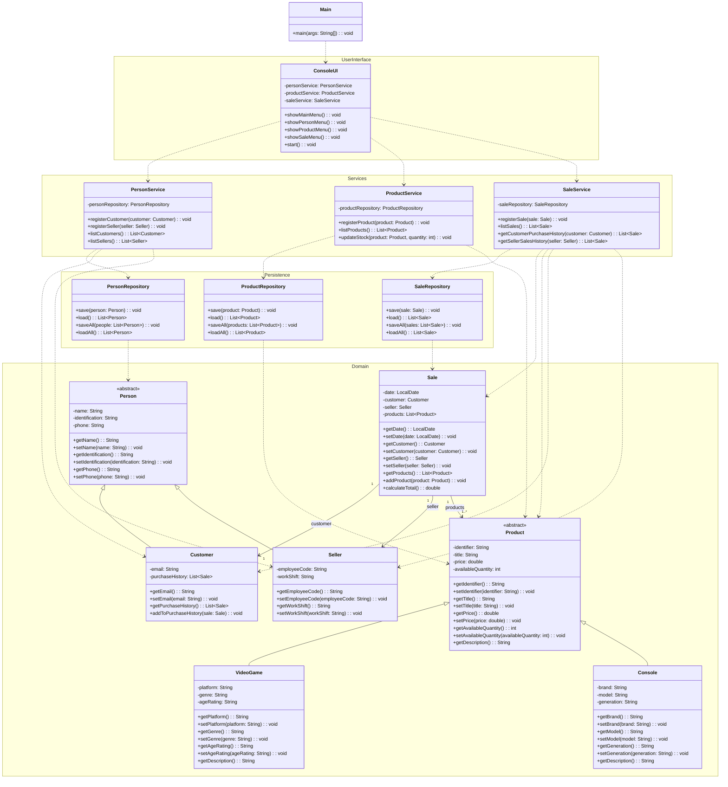

# Diagrama de Clases

```mermaid
---
config:
  layout: dagre
---
classDiagram
    direction TB

    %% =========================
    %% DOMAIN
    %% =========================

    namespace Domain {

        class Person {
            <<abstract>>
            -name: String
            -identification: String
            -phone: String
            +getName(): String
            +setName(name: String): void
            +getIdentification(): String
            +setIdentification(identification: String): void
            +getPhone(): String
            +setPhone(phone: String): void
        }

        class Customer {
            -email: String
            -purchaseHistory: List~Sale~
            +getEmail(): String
            +setEmail(email: String): void
            +getPurchaseHistory(): List~Sale~
            +addToPurchaseHistory(sale: Sale): void
        }

        class Seller {
            -employeeCode: String
            -workShift: String
            +getEmployeeCode(): String
            +setEmployeeCode(employeeCode: String): void
            +getWorkShift(): String
            +setWorkShift(workShift: String): void
        }

        class Product {
            <<abstract>>
            -identifier: String
            -title: String
            -price: double
            -availableQuantity: int
            +getIdentifier(): String
            +setIdentifier(identifier: String): void
            +getTitle(): String
            +setTitle(title: String): void
            +getPrice(): double
            +setPrice(price: double): void
            +getAvailableQuantity(): int
            +setAvailableQuantity(availableQuantity: int): void
            +getDescription(): String
        }

        class VideoGame {
            -platform: String
            -genre: String
            -ageRating: String
            +getPlatform(): String
            +setPlatform(platform: String): void
            +getGenre(): String
            +setGenre(genre: String): void
            +getAgeRating(): String
            +setAgeRating(ageRating: String): void
            +getDescription(): String
        }

        class Console {
            -brand: String
            -model: String
            -generation: String
            +getBrand(): String
            +setBrand(brand: String): void
            +getModel(): String
            +setModel(model: String): void
            +getGeneration(): String
            +setGeneration(generation: String): void
            +getDescription(): String
        }

        class Sale {
            -date: LocalDate
            -customer: Customer
            -seller: Seller
            -products: List~Product~
            +getDate(): LocalDate
            +setDate(date: LocalDate): void
            +getCustomer(): Customer
            +setCustomer(customer: Customer): void
            +getSeller(): Seller
            +setSeller(seller: Seller): void
            +getProducts(): List~Product~
            +addProduct(product: Product): void
            +calculateTotal(): double
        }
    }

    %% =========================
    %% PERSISTENCE
    %% =========================

    namespace Persistence {

        class PersonRepository {
            +save(person: Person): void
            +load(): List~Person~
            +saveAll(people: List~Person~): void
            +loadAll(): List~Person~
        }

        class ProductRepository {
            +save(product: Product): void
            +load(): List~Product~
            +saveAll(products: List~Product~): void
            +loadAll(): List~Product~
        }

        class SaleRepository {
            +save(sale: Sale): void
            +load(): List~Sale~
            +saveAll(sales: List~Sale~): void
            +loadAll(): List~Sale~
        }
    }

    %% =========================
    %% SERVICES
    %% =========================

    namespace Services {

        class PersonService {
            -personRepository: PersonRepository
            +registerCustomer(customer: Customer): void
            +registerSeller(seller: Seller): void
            +listCustomers(): List~Customer~
            +listSellers(): List~Seller~
        }

        class ProductService {
            -productRepository: ProductRepository
            +registerProduct(product: Product): void
            +listProducts(): List~Product~
            +updateStock(product: Product, quantity: int): void
        }

        class SaleService {
            -saleRepository: SaleRepository
            +registerSale(sale: Sale): void
            +listSales(): List~Sale~
            +getCustomerPurchaseHistory(customer: Customer): List~Sale~
            +getSellerSalesHistory(seller: Seller): List~Sale~
        }
    }

    %% =========================
    %% USER INTERFACE
    %% =========================

    namespace UserInterface {

        class ConsoleUI {
            -personService: PersonService
            -productService: ProductService
            -saleService: SaleService
            +showMainMenu(): void
            +showPersonMenu(): void
            +showProductMenu(): void
            +showSaleMenu(): void
            +start(): void
        }
    }

    %% =========================
    %% MAIN
    %% =========================

    class Main {
        +main(args: String[]): void
    }

    %% =========================
    %% INHERITANCE
    %% =========================

    Person <|-- Customer
    Person <|-- Seller

    Product <|-- VideoGame
    Product <|-- Console

    %% =========================
    %% SALE ASSOCIATIONS
    %% =========================

    Sale "1" --> "1" Customer : customer
    Sale "1" --> "1" Seller : seller
    Sale "1" --> "1..*" Product : products

    %% =========================
    %% LAYER DEPENDENCIES
    %% =========================

    PersonRepository ..> Person
    ProductRepository ..> Product
    SaleRepository ..> Sale

    PersonService ..> PersonRepository
    PersonService ..> Customer
    PersonService ..> Seller

    ProductService ..> ProductRepository
    ProductService ..> Product

    SaleService ..> SaleRepository
    SaleService ..> Sale
    SaleService ..> Product
    SaleService ..> Customer
    SaleService ..> Seller

    ConsoleUI ..> PersonService
    ConsoleUI ..> ProductService
    ConsoleUI ..> SaleService

    Main ..> ConsoleUI
```