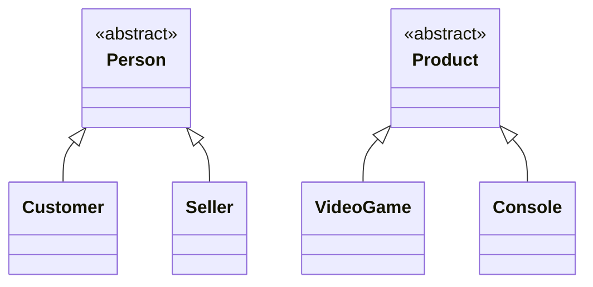

# Diagrama de Jerarquía

```mermaid
classDiagram

    class Person {
        <<abstract>>
    }

    class Customer
    class Seller

    class Product {
        <<abstract>>
    }

    class VideoGame
    class Console

    Person <|-- Customer
    Person <|-- Seller

    Product <|-- VideoGame
    Product <|-- Console
```